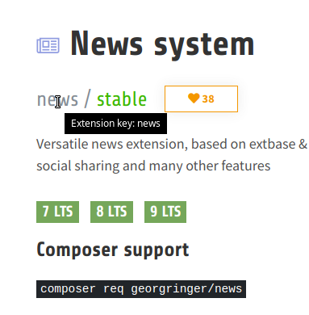

.. include:: ../Includes.txt

.. _extension-installation:

======================
Extension Installation
======================

.. tip::

   If you have installed TYPO3 with Composer, you should also
   :ref:`install extensions with Composer <install-extension-with-composer>`.

.. _install-extension-without-composer:

Install an Extension Without Composer
=====================================

In the backend:

.. rst-class:: bignums

1. Got to :guilabel:`"ADMIN TOOLS" > "Extensions"`
2. In the Docheader, select :guilabel:`"Get Extensions"`

   .. figure:: ../Images/em_extensions.png
      :class: with-shadow
      :alt: Select "Get Extensions" in Extension Manager

      Select "Get Extensions" in Extension Manager

3. Click :guilabel:`"Update now"`

   The button is on the top right.

   .. figure:: ../Images/em_extensions_get.png
      :class: with-shadow
      :alt: Search for the extension and install

      Search for the extension and install

4. Enter the name of the extension in the search field
5. Click on :guilabel:`"Go"`
6. Click on the Action icon on the left for the extension:

   :guilabel:`"Import and Install"`

   Now the extension is installed, but not activated. To activate:

7. Choose :guilabel:`"Installed Extensions"` in the Docheader
8. Click on the icon with a :guilabel:`"+"` sign for your extension
   in the :guilabel:`"A/D"` column.

.. _install-extension-with-composer:

Install an Extension With Composer
==================================

.. hint::

   These are the same steps that are used for :ref:`installing a distribution
   with Composer <installing-distribution-with-composer>`.

On the command line:

.. rst-class:: bignums

1. Find out the Composer package name and extension key of the extension:

   * :ref:`find-out-composer-package-name`
   * :ref:`find-out-extension-key`

2. Use `composer require`

   .. code-block:: shell

      composer require <packagename>

   For example:

   .. code-block:: shell

      composer require georgringer/news

   This will add the extension requirement to your :file:`composer.json`
   and install the extension.

   The extension will - not yet - be active. You must activate it with:

3. Activate

   .. code-block:: shell

      ./vendor/bin/typo3 extension:activate <extension key>

   For example:

   .. code-block:: shell

      ./vendor/bin/typo3 extension:activate news

.. _find-out-composer-package-name:

Find out Composer Package Name for an Extension
-----------------------------------------------

For example go to the `Extension Repository <https://extensions.typo3.org/>`__,
and search for the extension.

You should see the Composer command under :guilabel:`"Composer support"`,
for example `for the extension news <https://extensions.typo3.org/extension/news/>`__.

Here, the package name is `georgringer/news`.

   Detail view for extension "news"

Often the package name will be vendor + slash + extension key.
However, if the extension key contains an underscore, it is replaced
with a slash in the package name. Example for
`Extension Builder <https://extensions.typo3.org/extension/extension_builder/>`__:

* **extension key**: extension_builder
* **Composer package name**: friendsoftypo3/extension-builder

.. _composer-extension-dependencies:

Extension Dependencies
======================

This section is about finding out about extension dependencies for Composer installation.

When you install an extension, another extension may automatically have been installed
as was the case for the :ref:`installation of the Introduction Package <installing-introduction-package-with-composer>`:
The Introduction Package depends on the Bootstrap Package and this extension was installed
as well.

This is relevant, because after the installation, both need to be activated.

You can see the dependencies on https://packagist.org (for example for the 
`Introduction Package <https://packagist.org/packages/typo3/cms-introduction>`__)
or in the composer.json file of the extension, for example:

:file:`public/typo3conf/ext/introduction/composer.json`:

.. code-block:: json

   "require": {
      "typo3/cms-core": "^9.5",
      "typo3/cms-impexp": "^9.5",
      "typo3/cms-form": "^9.5",
      "typo3/cms-indexed-search": "^9.5",
      "typo3/cms-felogin": "^9.5",
      "bk2k/bootstrap-package": "^10.0"
   },

Here, the package name is bk2k/bootstrap-package, but the extension key is bootstrap_package,
as is explained in :ref:`find-out-composer-package-name`.

Additional Information
======================

The following is independant of whether you install with Composer or without.

.. _find-out-extension-key:

Find out the Extension Key for an Extension
-------------------------------------------

Again, go to the `Extension Repository <https://extensions.typo3.org/>`__,
and search for the extension.

   Detail view for extension "news"

The extension key is listed on the top. For the
`extension news <https://extensions.typo3.org/extension/news/>`__,
the extension key is `news`.

You can also see the extension key in your file system in the directory
:file:`public/typo3conf/ext/`. The directory name of the extension is the
same as the extension key.
