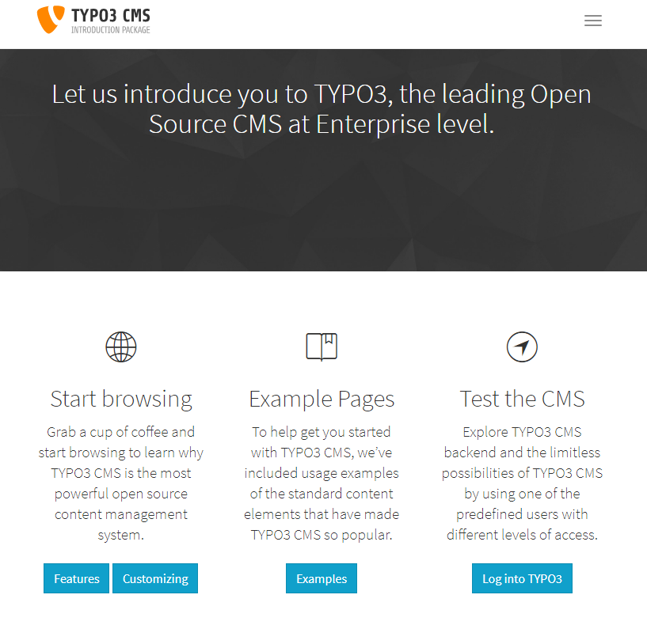

.. include:: ../../Includes.txt

.. _the-distributions:

=================
The Distributions
=================

Distributions were created to give new users easy access to a
preconfigured installation of TYPO3 that they could then use without the
need to set up and configure various parts of the CMS such as page
structure, content and templating.

When installing TYPO3 for the first time, you will be given the option to
access a set of "Preconfigured Distributions" once the installation is complete.
Upon selecting this option, you will be redirected to your installations "Extension Manger"
and given a list of Distributions to choose from.

For an existing installation of TYPO3, distributions are already available and
can be accessed in the Extension Manager.

.. note::

   If you installed TYPO3 via Composer, all extensions and distributions
   will need to be installed and managed via Composer.

.. _introduction-package:

Introduction Package
====================

The Introduction Package is a complete, fully operational website. It it based on a
responsive design using bootstrap templates and contains example
content for testing and evaluation. This is ideal for new users who wish
to have a "look around" and get more familiar with the CMS.

   The Introduction Package provides a fully operational website based on bootstrap.

.. _installing-distributions:

Installing Distributions Without Composer
=========================================

For testing and evaluation we recommend that you use the Introduction Package,
but several other distributions are available.

Move to the **ADMIN TOOLS > Extensions** module and choose
"Get preconfigured distribution" from the menu in the docheader.
Select the Distribution you would like to use and select the "Install"
button.

If you want to build your web site from scratch, just go ahead *without*
using a Distribution. You can then start with a completely empty
installation of TYPO3.

Installing Distributions With Composer
======================================

To install the Introduction Package or any other distribution on a Composer
based installation use `composer require typo3/cms-introduction` (change
the package name to the distribution you want). Afterwards use the
following commands to activate the extension(s) via command line:

.. code-block:: shell

   ./vendor/bin/typo3 extension:activate bootstrap_package
   ./vendor/bin/typo3 extension:activate introduction

In this case, the Introduction Package depends on the bootstrap_package, so
both packages have to be installed.

Move to the **ADMIN TOOLS > Extensions** module and choose "Get preconfigured
distribution" from the menu in the docheader. Just choose the Distribution you
would like to use and hit the "Install" button.
