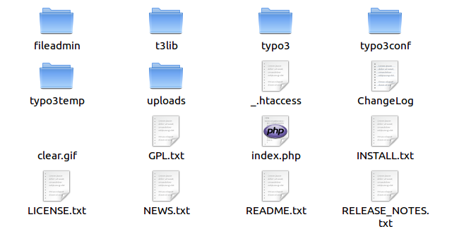

.. ==================================================
.. FOR YOUR INFORMATION
.. --------------------------------------------------
.. -*- coding: utf-8 -*- with BOM.

.. include:: ../../Includes.txt

.. _the-distributions-in-detail:

The Distributions in Detail
^^^^^^^^^^^^^^^^^^^^^^^^^^^

.. _the-zip-distribution:

The .zip distribution
"""""""""""""""""""""

These are the contents of the introduction package .zip-file:

.. _the-targz-distribution:

The .tar.gz distribution
""""""""""""""""""""""""

The .tar.gz distribution is mainly targeted at Unix users as it
contains relative symlinks. If you untar both the dummy and the source
at the same level and leave the file names intact, you will
automatically have correct symlinks.

The contents of the folder in which you extracted the Dummy package
might then be called something like "dummy-4.5.0" and the contents
might look like this:

.. figure:: ../../Images/Tar-gz-Distribution.png
   :alt: Files and folders of the .tar.gz-file.

The main point is - compared to the .zip distribution - that the
source directory only needs to be stored in the file-structure of the
Unix server only once. Then every website using the same TYPO3 version
can use symlinks to the proper folders of the source. Thus you save
space, because you avoid redundant files and get easy maintenance,
e.g. when you want to do an upgrade.

.. _typo3-folders-and-documents:

TYPO3 Folders and Documents
"""""""""""""""""""""""""""

The following files and folders are part of the TYPO3 Source package.

**t3lib/ and typo3/** contain the TYPO3 source code, files, images and
scripts distributed withTYPO3.

**index.php** is the main script for the website frontend (same as
typo3/sysext/cms/tslib/index\_ts.php).

**clear.gif** is a 1x1 clear-pixel gif-file. Used in many places.

**NEWS.txt** describes what has changed in the TYPO3 Source since the
last major version. Read this carefully if you are going to update
your system.

**INSTALL.txt** contains a short installation how-to.

All these files are a part of the TYPO3 Core. You should never change
them and you can write protect them, if you like! They are the ones
you must upgrade when you install a new version of TYPO3.

.. _site-specific-folders-and-documents:

Site specific Folders and Documents
"""""""""""""""""""""""""""""""""""

The following files and folders are part of the TYPO3 Dummy package.

**fileadmin/** contains files of your choice, local to the website.
You can e.g. put templates, user uploads, external scripts, external
html and images here. Also used by default to store uploaded files.
Must be writable for the webserver user.

**typo3temp/** should be empty from the beginning. But gradually
temporary files will appear here. The directory must be writable.

**uploads/** contains folders used to store documents attached to
database records - hence they should be writable!

**typo3conf/** contains configuration for the local site.

**\_.htaccess** contains configuration for Apache webservers, which
can improve performance. It is not used by default.

**typo3conf/localconf.php** is the main configuration file of your
installation and the one all the install tool options get written to.
It therefore has to be writable.

.. _custom-folders:

Custom folders?
"""""""""""""""

Yes, just add whatever you like. Why not?

