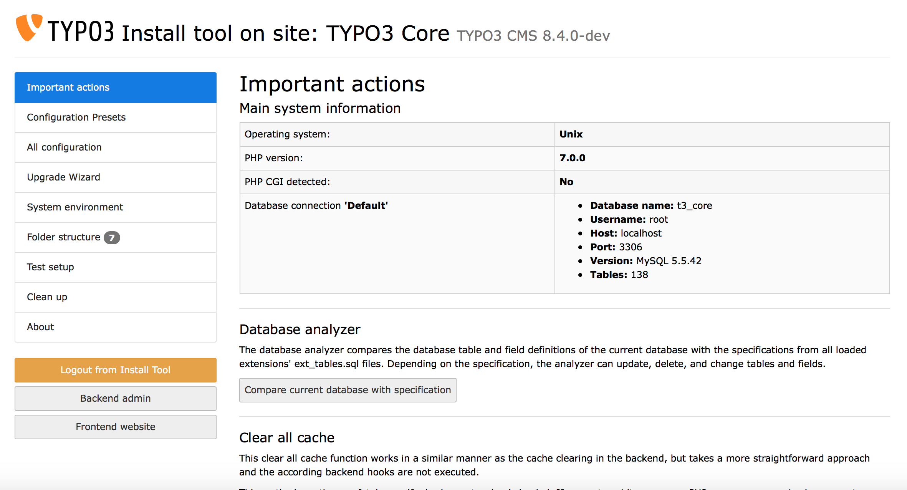

.. include:: ../../Includes.txt

.. _the-install-tool-in-depth:

The Install Tool
^^^^^^^^^^^^^^^^

The Install Tool provides tools to help you with the maintainance of your
installation: Upgrading, checking the system environment, configuring
settings from :code:`$TYPO3_CONF_VARS` and solving problems. Its
usage is not dependent on a working Backend, and you access it
using a single password.

First go to your site and enter the install tool (http://www.example.com/typo3/install).

.. hint::
	If you see a message "The Install Tool is locked", create a new file
	named "ENABLE_INSTALL_TOOL" in the folder :file:`typo3conf/`. Then reload the
	page.

.. _important-actions:

Important actions
"""""""""""""""""

The section provides basic information about your system and several
functions which you need for maintenance tasks or during an upgrade.

The **Database analyzer** can be used to compare the current structure
of your database with the expected structure for the TYPO3 version you
are using. The next step allows you to update the structure of your
database accordingly.

The **Clear all Cache** functionality can empty all caches: Frontend, 
Backend and language caches.

The **Check for broken extensions** can be run to make sure that
all :file:`ext_tables` and :file:`ext_localconf` files contain valid
PHP code, so that they can be loaded without breaking the system.

The **TCA Migrations** can be used to check whether the current TCA
needs migrations and displays applied migrations.

The **Core update** can update the TYPO3 Core to the newest minor version.

Apart from these functions, this section also contains options to
change the install tool password, to change the site name, to change the
encryption key and to create a Backend administrator user. Usually you
do not need these functions.

.. _configuration-presets:

Configuration presets
"""""""""""""""""""""

This section provides default settings for different setups.

The section "Character set conversion settings" allows you to select 
the program which should be used for character set conversions.

The section "Debug settings" allows you to activate debugging. E.g. if
set to "Debug", all kinds of error reporting, debugging and deprecation
logging will be activated. If set to "Live", all these settings will be
deactivated.

The "Image handling settings" contain presets for different image
processing programs (namely ImageMagick and GraphicsMagick). Select
the one you have available.

Finally the preset "Extbase object cache" allows you to choose the kind of
caching system for Extbase to use.

.. _all-configuration:

All configuration
"""""""""""""""""

Here you can configure *all* installation options concerning your TYPO3
installation. We suggest you go through the whole list and read the
description of the settings carefully at least once, so you get an
impression of what you can configure. Normally you *can*, but you *don't
have to* change anything here during installation, as the previous steps 
took care of the most important settings.

.. _upgrade-wizard:

Upgrade wizard
""""""""""""""

You don't need the upgrade wizard while *installing* TYPO3. This function 
will be explained in a later chapter about upgrading TYPO3.

.. _system-environment:

System environment
""""""""""""""""""

The section contains a huge number of environment checks, which notify
you of (potential) problems in your installation. It checks Apache
settings and the status of important PHP modules and PHP settings. It 
also contains full output of :code:`phpinfo()` and some constants used 
by TYPO3.

.. _folder-structure:

Folder structure
""""""""""""""""

This section shows whether the files and folders in your installation have
the correct permissions. This is important so that TYPO3 can function properly 
and so that other users on the web server do not get access to (possibly confidential)
data.

.. _test-setup:

Test setup
""""""""""

The section "Test setup" contains a test for the mail function and for
image processing. Try each test to see if you have configured your image
generation settings correctly. If you have problems, check the
explanation of the test for a hint on how to solve them. Additionally, 
have a look at the image processing settings in the section "All
configuration".

You might also find help in the :ref:`troubleshooting` section below.

.. _clean-up:

Clean up
""""""""

You don't need this section whilst installing TYPO3. This section is
meant to provide methods to clean up your TYPO3 installation after it
has been running for a while. You can use it to delete cached images,
which is helpful when you are configuring the image processing
settings. This section is also relevant during an upgrade.

