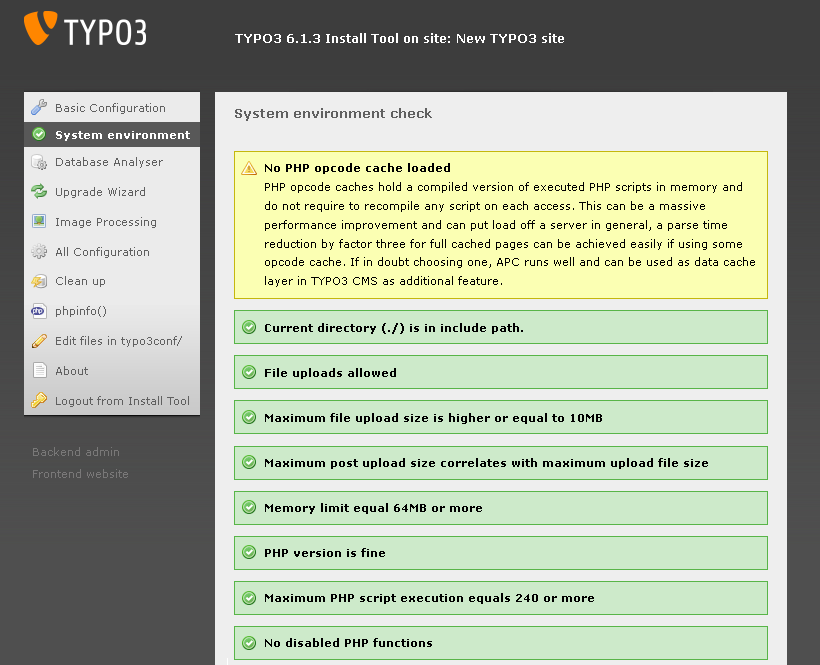

.. ==================================================
.. FOR YOUR INFORMATION
.. --------------------------------------------------
.. -*- coding: utf-8 -*- with BOM.

.. include:: ../../Includes.txt

.. _the-install-tool-in-depth:

The Install Tool
^^^^^^^^^^^^^^^^

To go on installing your new TYPO3 site, you can use the advanced mode
of the install tool. This allows you set up more details. This advanced
installation is described here.

First go to your site and enter the install tool (
`http://www.example.com/typo3/install
<http://www.example.com/typo3/install>`_ ).

(If you see a message "The Install Tool is locked", create a new file
named "ENABLE_INSTALL_TOOL" in the folder typo3conf/. Then reload the
page.)

.. _basic-configuration:

Basic Configuration
"""""""""""""""""""

The section basic configuration checks some prerequisites for
installing TYPO3.

There is a check for necessary folders and their rights. If anything
is wrong in this section, you have to add the folders and adjust the
file permissions before you continue.

One of the major features of TYPO3 is the ability to work with images
(transform them, use layers, masks etc.). For that to work you need to
have FreeType, gdlib and ImageMagick or GraphicsMagick available. The
next section checks for these.

Now in the next part you have to enter your database settings. Note
that you have to save after entering your username and host. After the
page has reloaded, you will get the database select box.

Choose a site name for your new website. This will later be displayed
in various places in the backend.

.. _system-environment:

System Environment
""""""""""""""""""

In the section system environment TYPO3 will inform you about errors
and warnings in your setup: Errors - displayed in red - point to an
actual problem and *must* be fixed in order to allow TYPO3 to perform
as expected. Warnings - displayed in yellow - point to a *potential*
problem and *should* be fixed.

These checks concern Apache settings and php.ini settings such as
memory\_limit, max\_execution\_time and so on. Again if something is
wrong, fix it before going any further.

         a warning.

.. _database-analyser:

Database Analyser
"""""""""""""""""

In this section you can get an overview of the database, which is
currently selected, compared to the needed tables and fields of a
correctly installed TYPO3 version. You can also import SQL data
directly into the database or upgrade tables from earlier versions of
TYPO3.

If you came here while installing your new web site, you have to click
"COMPARE" and then check all changes. After that click "Write to
database". This may take a little while.

Afterwards choose "IMPORT" to import static data. Static data consists
of predefined data sets that can be used by TYPO3, for example
languages, currencies or TYPO3 repository locations. If you don't know
what you'll need, just import all of them.

If you did not use the "1-2-3"-mode, you have to create an admin user
via "Create admin user". This is the user account, with which you will
log into the Backend.

.. note::

   InnoDB is used as database engine for several tables. This helps to
   prevent locks and increases performance. Also InnoDB is more
   crash-resistant compared to MyISAM. We recommend to review your
   MySQL configuration and to ensure that your table space has the
   "autoexpand" option enabled. See the MySQL manual for more
   information about configuring InnoDB. If you do not have InnoDB
   enabled, MySQL will use MyISAM automatically and you don't need to
   take any actions.

.. _upgrade-wizard:

Upgrade Wizard
""""""""""""""

You don't need the upgrade wizard while *installing* TYPO3. It will be
explained in a later chapter about upgrading TYPO3.

.. _image-processing:

Image Processing
""""""""""""""""

The section image processing contains an explanation of the image
manipulation capabilities of TYPO3 and a test menu at the bottom. Try
each test to see if you configured your image generation settings
correctly. If you have problems, check the explanation of the test for
a hint on how to solve them. Additionally have a look at the image
processing settings in the section "All configuration".

You might also find help in the :ref:`trouble-shooting` section below.

.. _all-configuration:

All Configuration
"""""""""""""""""

Here you can configure *all* installation options concerning your TYPO3
installation. We suggest you go through the whole list and read the
description of the settings carefully at least once, so you get an
impression of what you can configure. Normally you can, but you don't
have to change anything here during installation as the steps before
already took care of the most important settings.

.. _clean-up:

Clean Up
""""""""

You don't need this section while installing TYPO3. This section is
meant to provide methods to clean up your TYPO3 installation after it
has been running for a while. You can use it to delete cached images,
which is helpful when you are configuring the image processing
settings. This section is also relevant during an upgrade.

.. _phpinfo:

phpinfo()
"""""""""

Here are some information about your installation, the full output of
phpinfo() and some constants used by TYPO3. This can help a lot when
finding and solving problems with your configuration.

.. _edit-files-in-typo3conf:

Edit files in typo3conf/
""""""""""""""""""""""""

Here you can edit the files in typo3conf/ directly, if you want to
make some quick changes. You normally don't need this section either.

.. _about:

About
"""""

The "About" section describes each of the install tool sections and –
more important – provides a possibility to change the install tool
password which you should *always* do when installing TYPO3.

.. warning::

   **Change the install tool password!**

   You should consider changing the install tool password as the very
   first thing you do when installing TYPO3. The default password is
   widely known and should never ever be in use on a live web server.
   If you used the "1-2-3"-mode of the Install Tool, then you have
   already changed the password.

