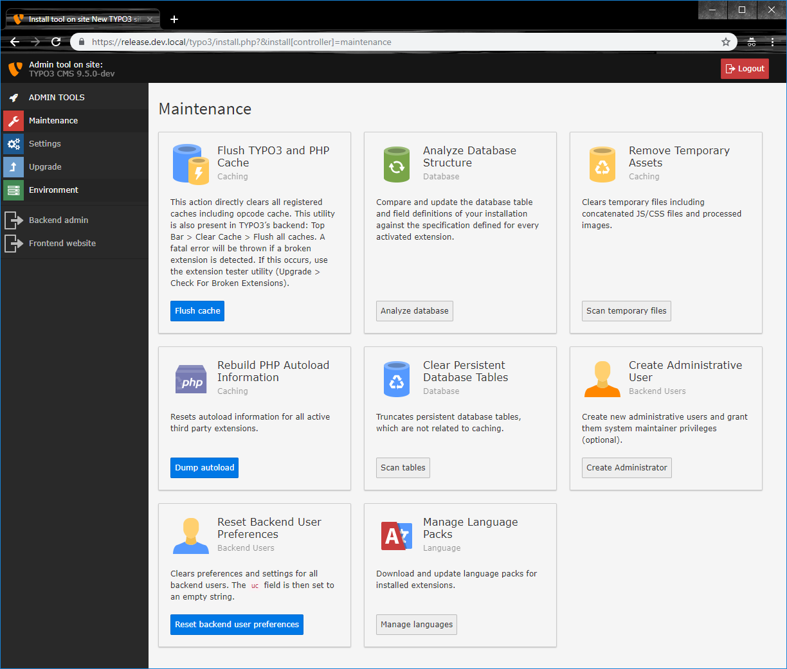

.. include:: ../../Includes.txt

.. _the-install-tool-in-depth:

=======================
TYPO3 System Management
=======================

The TYPO3 Admin Tool area provides tools to help with the maintenance of your
installation: Upgrading, checking the system environment, configuring settings
from and solving problems. The standalone tool usage is not dependent on a
working Backend, and you access it using a single password.

First go to your site and enter the admin tool via `/typo3/install.php`, e.g. https://www.example.com/typo3/install.php.

.. hint::

   If you see a message "The Install Tool is locked", create a new file named
   "ENABLE_INSTALL_TOOL" in the folder :file:`public/typo3conf/`. Then reload
   the page.

.. note::

   The Admin tool was called "Install Tool" in earlier versions, you will
   likely still see that term in some places.

.. _important-actions:

Maintenance
===========

The section provides basic information about your system and several functions
which you need for maintenance tasks.

   The "Maintenance" section of the Install Tool.

The **Flush TYPO3 and PHP Cache** functionality can empty all caches: Frontend,
Backend, language caches and the OPCode Cache.

With **Analyze Database Structure** you can compare the current structure of
your database with the expected structure for the TYPO3 version you are using.
The next step allows you to update the structure of your database accordingly.

**Remove Temporary Assets** allows you to clear temporary files and will
trigger regeneration when they are needed next.

**Rebuild PHP Autoload Information** resets autoload information for all active
third party extensions.

With **Clear persistent database tables** you can cleanup non-caching tables
like the history, log or backend sessions. Be aware that clearing backend
sessions will log out all active users. Clearing the history will remove all
history entries, you will not be able to use the content element history to
undo changes anymore.

"Create administrative user" allows to create a new administrator (if wanted
with system maintenance role on top). The system maintainer role adds the
maintenance tools to the menu and allows easy access to the standalone admin
tool.

If for some reason you or your editors have problems when editing in the TYPO3
backend, clearing the backend user settings might help. In those preferences
various settings of a backend editor are stored, for example: which page tree
nodes are currently expanded. Click on "Reset backend user preferences" to
clear these settings and set them to their defaults.

.. note::

   Some technical background: User settings get saved in the database table
   `be_users` in the `uc` (=User Configuration) field. When resetting the
   backend user preferences this field is set to an empty string.

Install new TYPO3 backend languages with the **Manage language packs**
functionality. You can update existing language packs (for example after
installing new extensions) or add new languages to the system. Afterwards, you
can choose between all installed languages in your user settings.

Settings
========

This area allows you to configure both TYPO3 extensions as well as the core.

In **Extension Configuration** you can configure all enabled extensions that
provide custom configuration options.

Via **Change Install Tool Password** you can set a new password for the
maintenance area.

With **Manage system maintainers** you can add new system maintainers (admin
users with the additional role of **system maintainers**). System maintainers
have easier access to the maintenance tools of TYPO3. Be aware that this is
mainly a usability enhancement, blinding maintenance options for normal
administrators. As administrators still have elevated permissions you should
still be careful which users can be trusted with these rights.

At **Configuration Presets** TYPO3 offers presets for common settings groups.
It allows for easier configuration of settings for debugging, image handling,
mail configuration and password hashing.

TYPO3 provides **Feature Toggles** for certain features that have a major
impact on your system. You can enable or disable these features here.

.. tip::

   On new installation it is recommended to activate the following features for
   TYPO3 9 LTS:

   - unifiedPageTranslationHandling
   - TypoScript.strictSyntax
   - simplifiedControllerActionDispatching

**Configure Installation-Wide Options** (previously known as "All
Configuration") allows you to configure settings that impact how your complete
TYPO3 installation behaves.

.. tip::

   If you are new to TYPO3, take some time to read through all the options and
   their explanation to get an impression of what TYPO3 offers.

The **Check for broken extensions** can be run to make sure that all
:file:`ext_tables` and :file:`ext_localconf` files contain valid PHP code, so
that they can be loaded without breaking the system.

The **TCA Migrations** can be used to check whether the current TCA needs
migrations and displays applied migrations.

The **Core update** can update the TYPO3 Core to the newest minor version.

Apart from these functions, this section also contains options to change the
install tool password, to change the site name, to change the encryption key
and to create a Backend administrator user. Usually you do not need these
functions.

.. _upgrade-wizard:

Upgrade
=======

You don't need the upgrade section while *installing* TYPO3. These functions
will be explained in a later chapter about upgrading TYPO3. See
:ref:`upgrade`.

.. _system-environment:

Environment
===========

The section contains a huge number of environment checks, which notify you of
(potential) problems in your installation.

The **Environment Overview** provides a short system overview that you can also
access via Application Information in the top bar.

The **Environment Status** runs checks on your server environment and reports
potentially wrong or missing settings.

With **Directory Status** you can check whether all required files and folders
exist and are writable when necessary. It also shows the default file and
folder permissions TYPO3 will apply on creation of assets.
It offers you the possibility to create a file :file:`.htaccess` in the TYPO3 root directory.
This is the recommended way.

**PHP Info** simply outputs the `phpinfo()`.

**Test Mail Setup** allows you to test the mail setup of TYPO3 by sending a
test mail.

.. tip::

   If the test mail does not arrive, check the settings via "Settings" >
   "Configuration Presets" > "Mail".

**Image Processing** checks various image rendering capabilities of your system
and displays hints if something goes wrong.

.. tip::

   If rendering fails you can copy the executed command and see if it works on
   your favorite command line. If that works, the tool itself is working but
   TYPO3 might have problems executing it. If the command does not work, you
   might need to adjust the settings (via "Settings" > "Configuration Presets"
   > "Image Handling").

