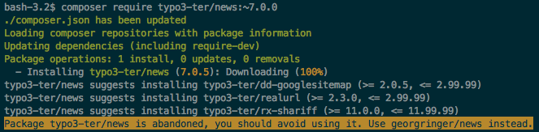

.. include:: ../Includes.txt
.. highlight:: bash

===============
Migration steps
===============

Delete files
============

Yes, that's true. You have to delete some files, because they will be created by
composer in some of the next steps.

You have to delete, :file:`public/index.php`, :file:`public/typo3/` and all the
extensions inside :file:`public/typo3conf/ext/`, you downloaded from TER or any
other resources like GitHub. You even have to delete your own extensions, if
they are available in a separate Git repository and, for example, included as
Git submodule.

Please keep only your sitepackage extension or any other extension, which was
explicitly built for your current project and does not have an own Git
repository.

Configure composer
==================

Create a file with name :file:`composer.json` in your project root, not inside
your web root. At the moment, only these few lines are required:

.. code:: json

    {
        "repositories": [
            {
                "type": "composer",
                "url": "https://composer.typo3.org/"
            }
        ],
        "extra": {
            "typo3/cms": {
                "cms-package-dir": "{$vendor-dir}/typo3/cms",
                "web-dir": "public"
            }
        }
    }

You must set the correct name of your web root folder in property ``web-dir``.

Add all required packages to your project
=========================================

You can add all your required packages with the composer command ``composer
require``. The full syntax is::

    composer require anyvendorname/anypackagename:version

**Example**::

    composer require typo3/cms:~7.6.0

There are different ways to define the version of the package, you want
to install. The most common syntaxes start with ``^`` (e.g.
``^7.6``) or with ``~`` (e.g. ``~7.6.0``). A full documentation can be
found at https://getcomposer.org/doc/articles/versions.md

In short:

*  ``^7.6`` or ``^7.6.0`` tells composer to add newest package of
   version 7.\* with at least 7.6.0, but not version 8.

*  ``~7.6.0`` tells composer to add the newest package of version
   7.6.\* with at least 7.6.0, but not version 7.7.

You have to decide by yourself, which syntax fits best to your needs.

Install the core
----------------

The old way: add everything
~~~~~~~~~~~~~~~~~~~~~~~~~~~

As already written above, the line to install TYPO3 7 LTS would be::

    composer require typo3/cms:~7.6.0

While installing TYPO3 8 LTS works with this line::

    composer require typo3/cms:~8.7.0

The new way: add only code, you need
~~~~~~~~~~~~~~~~~~~~~~~~~~~~~~~~~~~~

Since TYPO3 8.7.10 you **can** use a concept, called "subtree split". It
will be **mandatory** for TYPO3 9. The concept means, you will not copy
the full TYPO3 core package, including all system extensions, you will
never use. But only install what you really want. You will not be able
to install ``typo3/cms:^9``, but have to name each system extension::

    composer require typo3/cms-core:~9.0.0
    composer require typo3/cms-backend:~9.0.0
    composer require typo3/cms-frontend:~9.0.0
    composer require ... 

Or in one line::

    composer require typo3/cms-core:~9.0.0 typo3/cms-backend:~9.0.0 typo3/cms-frontend:~9.0.0 ... 

To find the correct package names, you can either take a look in the
``composer.json`` of any system extension or follow the naming
convention
``typo3/cms-<extension name with dash "-" instead of underscore "_">``,
e.g. ``typo3/cms-fluid-styled-content``.

Install extensions from packagist.org
-------------------------------------

You already know the TER and always used it to install extensions? Fine.
But with composer, the **preferred way** is to install extensions
directly from `packagist.org <https://packagist.org>`__. This works great, when the maintainer uploaded them
to there. Many well known extensions are already available.
You only need to known the package name. There are multiple ways to find it.

Check manually
~~~~~~~~~~~~~~

This is the most exhausting way. But it will work, even if the extension maintainer
does not provide additional information.

#. Search and open the extension, you want to install, in
   `TER <https://extensions.typo3.org>`__.

#. Click button "Take a look into the code".

   |TER screen shot|

#. Open file :file:`composer.json`.

   |file list|

#. Search for line with property ``"name"``, it's value should be
   formatted like ``vendor/package``.

   |file content|

#. Check, if the package can be found on
   `packagist.org <https://packagist.org>`__.

   |packagist screen shot|

**Example:**
To install the news extension in version 7.0.\*, type::

   composer require georgringer/news:~7.0.0

Check in TER satis
~~~~~~~~~~~~~~~~~~

Extension maintainers optionally can link their TYPO3 extension in TER with the
correct composer key on `packagist.org <https://packagist.org>`__. Some maintainers already did that and if you
search the extension in https://composer.typo3.org/satis.html, you will see a message, which composer key should be
used to install this extension.

|satis abandoned note|

See warning during composer require command
~~~~~~~~~~~~~~~~~~~~~~~~~~~~~~~~~~~~~~~~~~~

If you still install one of the abandoned extensions via its ``typo3-ter`` package key,
you also will see a warning during the ``composer require`` command.

|composer abandoned note|

Install extension from TER
--------------------------

If the extension is not available on packagist, the good news is: All
TER extensions are available via composer! That's, why we added
``https://composer.typo3.org/`` as repository to our ``composer.json``
some lines above. There are little naming conventions:

*  Vendor name is ``typo3-ter``.

*  Underscores ``_`` are replaced by dash ``-``.

**Example:**

The extension ``any_fancy_extension``'s auto generated composer package
name would be ``typo3-ter/any-fancy-extension``. To add this extension in
version 1.2.\*, type::

   composer require typo3-ter/any-fancy-extension:~1.2.0

You can browse all available extensions and versions via
https://composer.typo3.org/satis.html.

.. note ::

    If you do not include any packages this way, you can remove the
    repository block named `https://composer.typo3.org` from your
    :file:`composer.json` to improve speed.

Install extension from version control system (e.g. GitHub, Gitlab, ...)
------------------------------------------------------------------------

In some cases, you will have to install an TYPO3 extension, which is not
available on packagist.org or in the TER. Examples could be:

*  non-public extension only used by your company.

*  you forked and modified an existing extension.

As first step, you have to define the repository in your
``composer.json``'s "repository" section. In this example, you find the
additional lines added to the ``composer.json`` from above:

.. code:: json

    {
        "repositories": [
            {
                "type": "composer",
                "url": "https://composer.typo3.org/"
            },
            {
                "type": "vcs",
                "url": "https://github.com/foo/bar.git"
            }
        ],
        "extra": {
            "typo3/cms": {
                "cms-package-dir": "{$vendor-dir}/typo3/cms",
                "web-dir": "public"
            }
        }
    }

The Git repository must be a TYPO3 extension, with all the required
files (e.g. ``ext_emconf.php``) and must contain a valid
``composer.json`` itself. How this file should look in your extension,
can be found on `composer.typo3.org <https://composer.typo3.org/>`__ or
`this blog post from Helmut Hummel <https://insight.helhum.io/post/148886148725/composerjson-specification-for-typo3-extensions>`__.
Please note, that Git tags are used as version numbers.

If you fulfill these requirements, you can add your extension in the
same way like the other examples::

    composer require foo/bar:~1.0.0

.. _mig-composer-include-individual-extensions:

Include individual extensions like sitepackages
===============================================

It's not necessary to move your project's sitepackage to a dedicated
Git repository to re-include it in your project. You can keep the files
in your main project (e.g. ``public/typo3conf/ext/my_sitepackage``). There is
only one thing to do; Because TYPO3's autoload feature works differently
in composer based installations, you have to register your PHP class
names in composer. This is very easy when you use PHP namespaces:

.. code:: json

        "autoload": {
            "psr-4": {
                "VendorName\\MySitepackage\\": "public/typo3conf/ext/my_sitepackage/Classes/",
                "VendorName\\AnyOtherExtension\\": "public/typo3conf/ext/any_other_extension/Classes/"
            }
        }

For extension without PHP namespaces, this section has to look a bit
differently. You can decide by yourself, if you want to list each PHP file
manually or if composer should search for them inside a folder:

.. code:: json

        "autoload": {
            "classmap": [
                "public/typo3conf/ext/my_old_extension/pi1/",
                "public/typo3conf/ext/my_old_extension/pi2/class.tx_myoldextension_pi2.php"
            ]
        }

To complete our example ``composer.json``, it would look like this:

.. code:: json

    {
        "repositories": [
            {
                "type": "composer",
                "url": "https://composer.typo3.org/"
            },
            {
                "type": "vcs",
                "url": "https://github.com/foo/bar.git"
            }
        ],
        "extra": {
            "typo3/cms": {
                "cms-package-dir": "{$vendor-dir}/typo3/cms",
                "web-dir": "public"
            }
        },
        "autoload": {
            "psr-4": {
                "VendorName\\MySitepackage\\": "public/typo3conf/ext/my_sitepackage/Classes/",
                "VendorName\\AnyOtherExtension\\": "public/typo3conf/ext/any_other_extension/Classes/"
            },
            "classmap": [
                "public/typo3conf/ext/my_old_extension/pi1/",
                "public/typo3conf/ext/my_old_extension/pi2/class.tx_myoldextension_pi2.php"
            ]
        }
    }
    
After adding files to the autoload you should run `composer dumpautoload`. This command will re-generate the vendor/autoload.php file

.. note::

    If you want to keep your :file:`typo3conf/ext` directory empty and ``autoload`` information only
    in extensions' :file:`composer.json`, but not in your project's :file:`composer.json`,
    there is an alternative way to include your individual extensions in the chapter
    :ref:`completely clear "typo3conf/ext" folder <mig-composer-clear-typo3conf-ext-folder>`
    in the :ref:`Best practices <mig-composer-best-practices>` section.

.. |TER screen shot| image:: ../Images/ter-code-link.png
.. |file list| image:: ../Images/github-composer-file.png
.. |file content| image:: ../Images/github-composer-name.png
.. |packagist screen shot| image:: ../Images/packagist-news.png
.. |satis abandoned note| image:: ../Images/satis-abandoned.png

