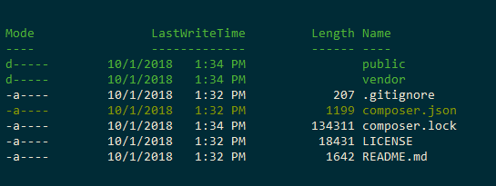

.. include:: ../../Includes.txt
.. highlight:: shell

.. _install-via-composer:

==========================
Install TYPO3 via composer
==========================

.. attention::

   The recommended way of installing TYPO3 is via Composer, as described on
   this page.

To create a new TYPO3 project use the TYPO3 Base Distribution::

	# Download the Base Distribution, the latest "stable" release (9.5)
	composer create-project typo3/cms-base-distribution YourNewProjectFolder

.. note::

   To install TYPO3 via the `composer` command on windows, it should be started as admin
   or explicitly given the right to create symlinks (use for example a
   powershell or git bash started with admin rights).

After `composer create project ...` executed, you should have the following folder structure:

   The folder structure after composer installation.

Point the document root of your web server to the `public` folder.

If you do not want to use Composer, follow the :ref:`package installation
guide <get-and-unpack-the-typo3-package>`.

Next Steps
==========

Continue with :ref:`the-install-tool`.

