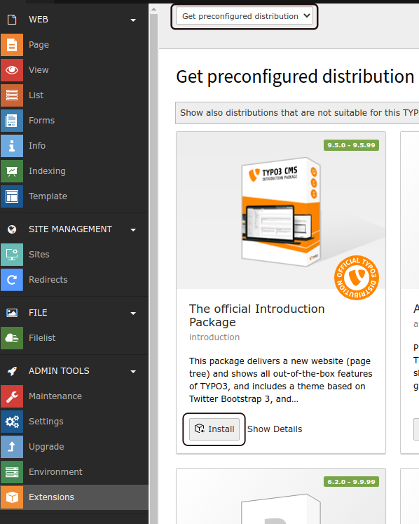
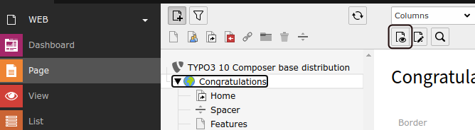

.. include:: /Includes.rst.txt

.. _install-introduction-package:

============================
Install Introduction Package
============================

.. hint::

   The Introduction Package creates a demo website! If you do not want
   that, skip this page and proceed to :ref:`install-next-steps`.

If you are using TYPO3 for the first time you may want to
see a working example of the CMS before you start work on
your own project.

The `Official Introduction Package
<https://extensions.typo3.org/extension/introduction/>`__ showcases many of
TYPO3's capabilities and gives you the ability to try them first hand.
The Introduction Package utilizes the `bootstrap_package extension
<https://extensions.typo3.org/extension/bootstrap_package/>`__
to generate multiple responsive HTML templates that you can select and try
out.

It also features examples of the different kinds page content that you
typically see on a website. Such as paragraphs of text, images, tables
and navigation menus.

Find more information in :ref:`introduction-package`.

.. _installing-introduction-package-with-composer:
.. _installing-distributions-wit-composer:

If you installed TYPO3 with Composer
====================================

To install the Introduction Package or any other distribution on a Composer
based installation use:

.. code-block:: shell

   composer require typo3/cms-introduction

Use the following commands to activate the extension(s) via the command line:

.. code-block:: shell

   ./vendor/bin/typo3 extension:activate bootstrap_package
   ./vendor/bin/typo3 extension:activate introduction

In this case, the Introduction Package depends on the Bootstrap Package
(extension key: `bootstrap_package`), so both packages have to be activated.

When done, proceed with :ref:`install-intro-first-steps`.

.. _installing-distributions:
.. _installing-distributions-without-composer:

If you installed TYPO3 without Composer
=======================================

You can select "Yes, download the list of distributions" in the last step of
the :ref:`the-install-tool` when you finish installing the CMS.

In the backend:

.. rst-class:: bignums-xxl

#. Go to :guilabel:`ADMIN TOOLS > Extensions`

#. Select :guilabel:`Get preconfigured distributions` in the select box.

#. Install the Introduction Package

   The first distribution on the top left should be the official "Introduction Package".
   Click on :guilabel:`Install` to install.

.. _install-intro-first-steps:

First steps with the Introduction Package
=========================================

The "Introduction Package" creates some pages. The top level page is named "Congratulations".

.. rst-class:: bignums-xxl

#. Click on "Congratulations" in the page tree.

#. View the page in the frontend:

   Click on the :guilabel:`"View webpage"` icon (with an eye) to view the page
   in the frontend.

.. tip::

   Learn more about using the backend in the "Getting Started Tutorial's" :ref:`t3start:general-principles`
   chapter.

