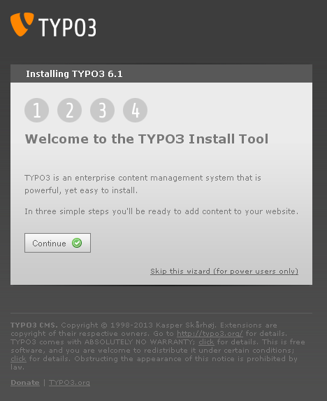
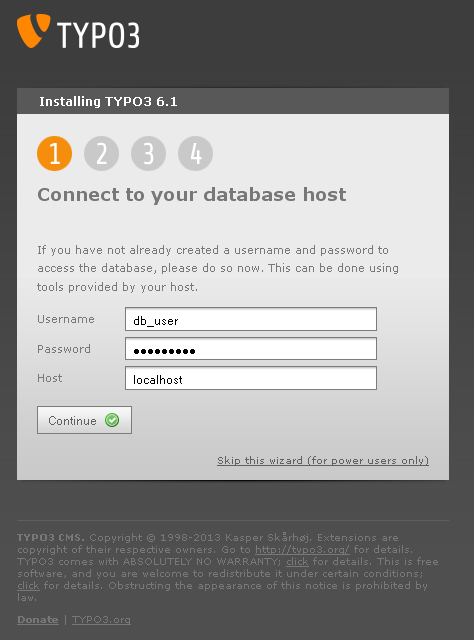
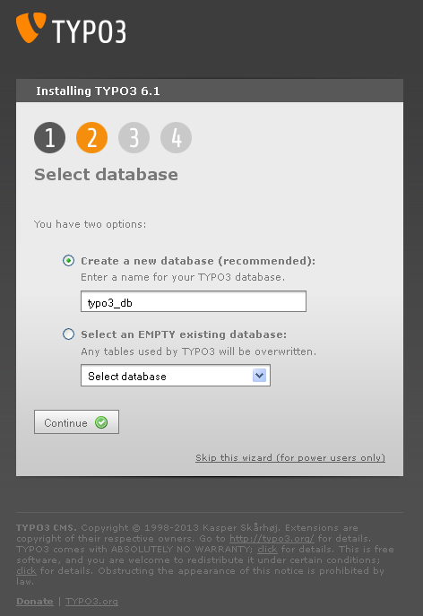
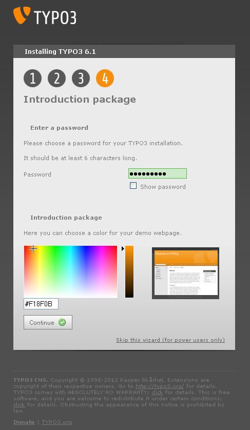
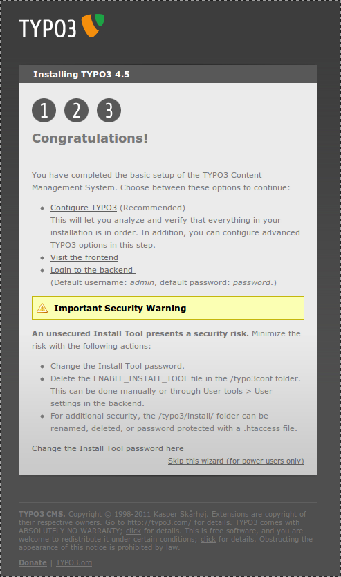

.. ==================================================
.. FOR YOUR INFORMATION
.. --------------------------------------------------
.. -*- coding: utf-8 -*- with BOM.

.. include:: ../../Includes.txt

.. _the-install-tool:

The Install Tool
^^^^^^^^^^^^^^^^

The Install Tool is located in 'typo3/install/' and should
automatically start in "1-2-3"-mode with password 'joh316'.

In other words, this is what you should see:

To get to the next step, always click "Continue".

*Enter your database credentials.* Enter MySQL username and password.
In most cases the database host is "localhost".

*Create a new database for TYPO3 or use an existing empty
database.*

.. figure:: ../../Images/Quick-1-2-3-Third-Step.png
   :alt: Install Tool in 1-2-3 mode, third step.

*Choose a package.* The actual installation process may take some time.

*Enter a password and choose a color.* Enter a password for the Install
Tool and for the preconfigured TYPO3 Backend users.

*The basic installation is now complete!*

After you finished the basic installation procedure, TYPO3 basically
is working. However, there still are options, which have not been
configured yet. We therefore recommend to go to the install tool in
normal mode to verify the details of your configuration. Click the
"Skip this wizard (for power users only)" link to do so.

You can find more information in the section "In-Depth Installation",
subsection ":ref:`the-install-tool-in-depth`" below.

