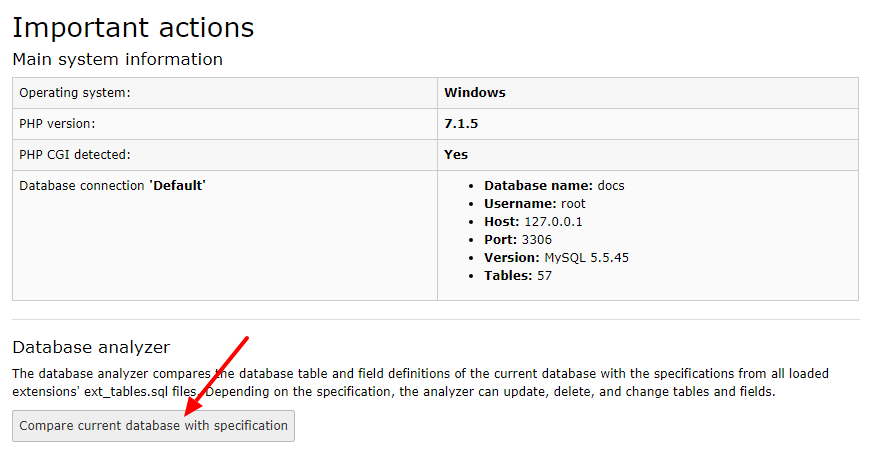
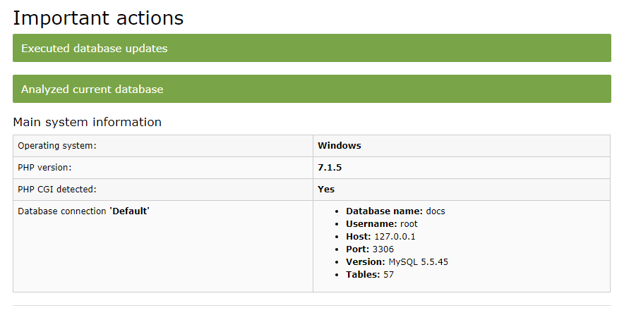
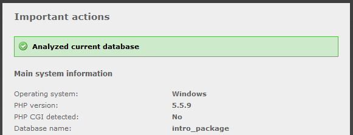

.. ==================================================
.. FOR YOUR INFORMATION
.. --------------------------------------------------
.. -*- coding: utf-8 -*- with BOM.

.. include:: ../../Includes.txt

.. _4-run-the-database-analyzer:

4: Run the Database Analyzer
^^^^^^^^^^^^^^^^^^^^^^^^^^^^

Now you can use the section "Important actions" to compare the
structure of your database with the expected structure. While in the
previous step, tables and columns have been *changed or added*, this
step now gives you the possibility to *remove* old and unneeded tables
and columns from the database. Click "Compare current database with
specification".

You will be able to execute queries to remove these tables and columns
so that your database corresponds to the structure required for the new
TYPO3 version.

.. warning::

   Be aware if you have deliberately added columns and/or tables to your
   TYPO3 database for your own purposes! Those tables and columns are
   removed only if you mark them to be deleted of course, but please be
   alert that you don't delete them by mistake!

In the next step the changes you applied don't show up again. If you
chose to delete some columns or tables, you will see that they have
only been renamed. Now you can consider to let them be and delete them
later when you're sure you're not going to need them. Or you can mark
them again and drop them finally.

If you made TYPO3 apply all changes, you should after clicking
"Execute" see a notice like this:

         and field definitions.

When you then click "Compare current database with specification" again
and you only see the message

then all database updates have been applied.

