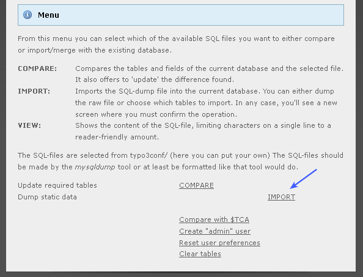
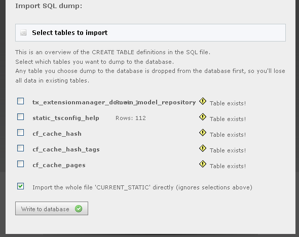
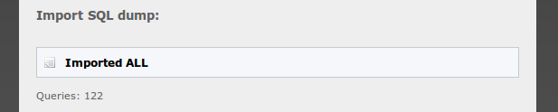

.. ==================================================
.. FOR YOUR INFORMATION
.. --------------------------------------------------
.. -*- coding: utf-8 -*- with BOM.

.. include:: ../../Includes.txt

.. _5-install-the-new-static-tables-and-description-tables:

5: Install the new static Tables and Description Tables
^^^^^^^^^^^^^^^^^^^^^^^^^^^^^^^^^^^^^^^^^^^^^^^^^^^^^^^

The table 'static\_template' (and some other "static\_" tables)
contain information that you should never alter yourself. These
tables contain static information distributed with TYPO3 releases.
Follow these steps to upgrade the tables with the newest information.

Go to the section "**Database Analyser**".

Then click "**IMPORT**" in the line "**Dump static data**":

Then tick the check box "Import the whole file..." and click "Write to
database":

... and you should see this:

