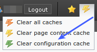

.. ==================================================
.. FOR YOUR INFORMATION
.. --------------------------------------------------
.. -*- coding: utf-8 -*- with BOM.

.. include:: ../../Includes.txt

.. _7-remove-temp-cached-files:

7: Remove "temp\_CACHED\_" files
^^^^^^^^^^^^^^^^^^^^^^^^^^^^^^^^

In typo3conf/ you will most likely find cached files of
ext\_localconf.php and ext\_tables.php files. These must be removed as
well.

All files in typo3conf/ directory which are named
"temp\_CACHED\_\*\_ext\_localconf.php" or
"temp\_CACHED\_\*\_ext\_tables.php" should be removed!

An easy way to clear these files is pressing the link which you find
at the top right side of the backend when you are logged in as an
admin user. Open the "Clear cache" menu and click "Clear configuration
cache":

However, only two "temp\_CACHED\_" files in typo3conf/ will be removed
by this method. If you see more than two of these, you have to remove
the rest either manually or with the "extdeveval" extension!

