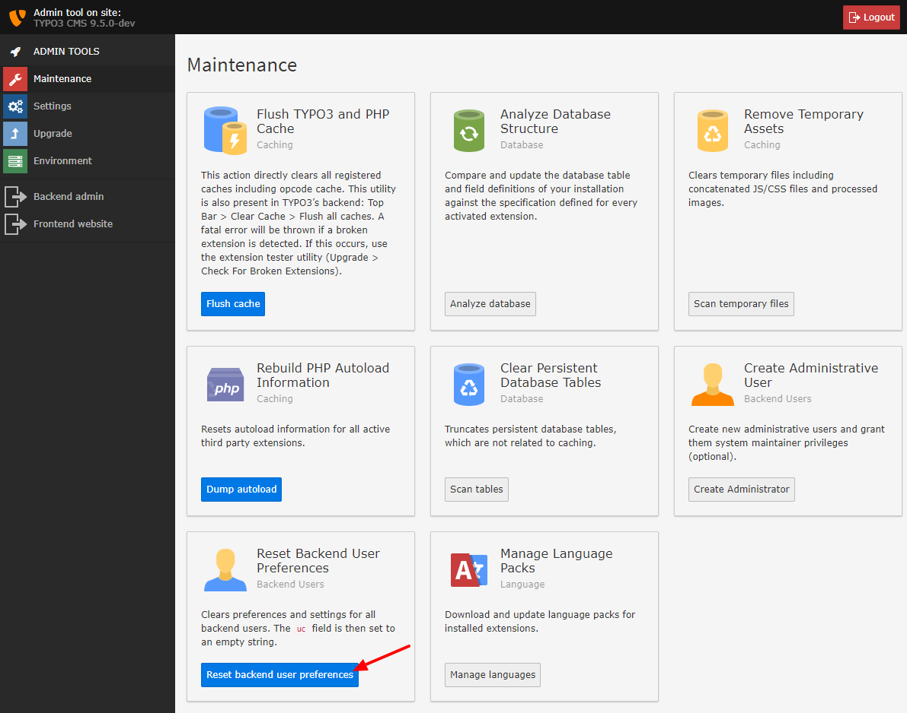

.. include:: ../../Includes.txt

.. _clear-caches-and-user-settings:

===================
Clear User Settings
===================

You might consider clearing the Backend user preferences. This
can avoid problems, if something in the upgrade requires this. Go to
"Clean up", scroll to "Reset user preferences" and click "Reset backend
user preferences".

   Reset user preferences in install tool.
