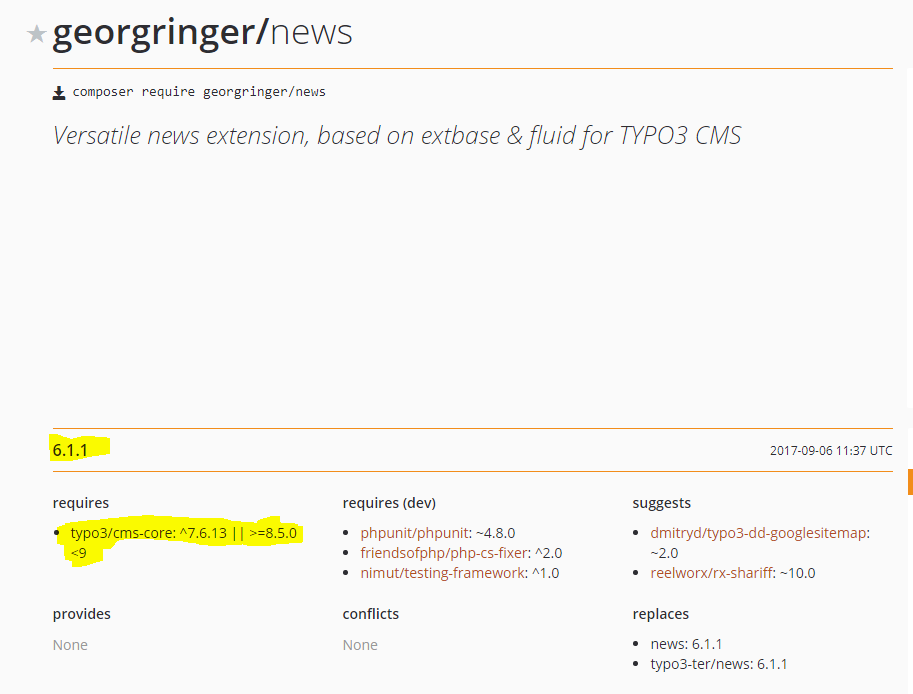

.. include:: ../../Includes.txt

.. Use syntax highlighting for shell commands by default
   on this page

.. highlight:: shell

.. _install-the-new-source:

======================
Install the New Source
======================

.. note::

   The recommended installation of TYPO3 is based on Composer.

Upgrading a Composer Based System
=================================

.. caution::

   TYPO3 v9 LTS has no support for the package `typo3/cms` anymore—instead
   all TYPO3 system extensions are now single packages. When upgrading, remove
   the `typo3/cms` package and use require to fetch the single packages you need.

Use Composer to update your system via for example::

   composer require typo3/cms-backend:^9.5 typo3/cms-core:^9.5 \
      typo3/cms-extbase:^9.5 typo3/cms-extensionmanager:^9.5 \
      typo3/cms-filelist:^9.5 typo3/cms-fluid:^9.5 typo3/cms-frontend:^9.5 \
      typo3/cms-install:^9.5 typo3/cms-recordlist:^9.5 \
      --update-with-dependencies

If you have extensions installed, find the corresponding newer
versions you want to install for your new major version, and update them too.

Example::

   composer require typo3/cms-backend:^9.5 typo3/cms-core:^9.5 \
      typo3/cms-extbase:^9.5 typo3/cms-extensionmanager:^9.5 \
      typo3/cms-filelist:^9.5 typo3/cms-fluid:^9.5 typo3/cms-frontend:^9.5 \
      typo3/cms-install:^9.5 typo3/cms-recordlist:^9.5 georgringer/news:^7.0 \
      --update-with-dependencies

.. tip::

   To make selecting the packages easier, you can use the TYPO3 `Composer Helper
   <https://get.typo3.org/misc/composer/helper>`_ to find the packages you need.

To find the matching extension versions you can go to `packagist.org
<https://packagist.org/>`_, search for your extension and take a look at the
"requires" section.

.. tip::

   The list of system extensions developed directly in the TYPO3 core repository
   changes from time to time: Some extensions are merged into others, new system extensions
   are added, and others abandoned or released to the public (and therefore maintained at a
   different place).
   You will find info on the details in this `list
   <https://docs.typo3.org/Home/SystemExtensions.html>`_ or search in the
   `breaking changes <https://docs.typo3.org/c/typo3/cms-core/master/en-us/Index.html>`_
   for the extension key (not the package name!).

   The "News" extension on packagist

.. _install-next-step:
.. _install-core-updater:

Using the Core Updater
======================

The "Install Tool" in the section "Important Actions" provides a function to
update the TYPO3 Core.

In the section "Important Actions" scroll down to "Core update" and click the
"Check for core updates" button. If the requirements are met, TYPO3 will
automatically install the new source code.

.. note::

   For the Core Updater to work, the following setup is required:

   * It only works in Unix-like systems (including macOS).

   * :file:`typo3_src` must be a symlink.

   * This symlink needs to be writable (and deletable) by the web-server user.

   * The document root needs to be writable.

   * One path above document root (:file:`../`) needs to be writable (creation
   of new directories must be allowed).

   * The :program:`tar` command must be available (for extracting the Source
     package).

Disabling the Core Updater
--------------------------

The Core Updater functionality can be turned off, in order to avoid users using it,
i.e. if you use your own update mechanism.

This feature is already disabled when TYPO3 is installed via Composer.

To disable the core updater, you can set this environment variable::

   TYPO3_DISABLE_CORE_UPDATER=1

For example in Apache:

.. code-block:: apacheconf

   SetEnv TYPO3_DISABLE_CORE_UPDATER 1

or for NGINX:

.. code-block:: nginx

   server {
     location ~ path/to/it {
       include fastcgi_params;
       fastcgi_param TYPO3_DISABLE_CORE_UPDATER "1";
     }
   }

This will remove the button and all related functionality in the Install
Tool.

.. _install-manually:

Installing the Source Manually
==============================

Go to `http://typo3.org/download/ <http://typo3.org/download/>`_ and download
the source package of the new TYPO3 version.

Extract the package on your web server and, in your TYPO3 document root,
adjust the :file:`typo3_src` symlink.

What's the Next Step?
=====================

In case you performed a *minor update*, e.g. from TYPO3 9.5.0 to 9.5.1, database
updates are usually *not* necessary, though you still have to
:ref:`remove the temporary cache files <remove-temporary-cache-files>`. After
that your update is finished.

.. note::

   Make sure to read the release notes of even the minor versions carefully. While
   great care is taken to keep the minor updates as easy as possible, (especially
   when releasing security updates) more steps might be necessary.

In case of a *major update*, e.g. from TYPO3 8.7 to 9.5, go ahead with the next
step!

Also check out any breaking changes listed in `Changelog
<https://docs.typo3.org/typo3cms/extensions/core/>`_ for the new version.
