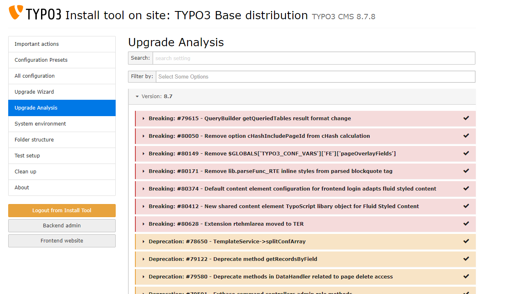

.. include:: /Includes.rst.txt

.. _preparation:
.. _beforeUpgrading:

================
Before upgrading
================

* You should use the latest version of a previous major version before you upgrade!
  For example, upgrade to latest 9.5.x before you upgrade to version 10.

Before starting the upgrade check your system for compatibility with a newer
TYPO3 version.

* Before you upgrade to the next major version, make sure you have run all
  Upgrade Wizards of the the current TYPO3 major version.

* Check for deprecations: Enable the deprecation log and let it log all
  deprecations for a while.

* Alternatively (or additionally) run the
  :ref:`extension scanner <t3coreapi:extension-scanner>` and
  :ref:`handle deprecations <handling-deprecations>` (below).

* Check installed extensions for versions compatible to the target TYPO3
  version

* Try the upgrade on a development system first or create a parallel instance

Check that all system requirements for upgrading are met:

* See :ref:`system-requirements`

.. _handling-deprecations:

Handling Deprecations
=====================

If you notice some API you are using is deprecated, you should look up the
corresponding `ChangeLog <https://docs.typo3.org/c/typo3/cms-core/master/en-us/>`_
entry and see how to migrate your code corresponding to the documentation.

Since TYPO3 v9 an :ref:`extension scanner <t3coreapi:extension-scanner>` is
included, that provides basic scanning of your extensions for deprecated code.
While it does not catch everything, it can be used as a base for an upgrade. You
can either access the extension scanner via the TYPO3 admin tools (in the
Backend: :guilabel:`Module "Upgrade" > "Scan Extension Files"`)
or as a standalone tool (https://github.com/tuurlijk/typo3scan).

The extension scanner will show the corresponding changelog which contains
a description of how to migrate your code. See :ref:`check-the-changelog-and-news-md`
for more information about the Changelogs and how to read them.

.. note::

   TYPO3 aims at providing a reliable backwards compatibility between versions:

   *  Minor versions are always backwards compatible - unless explicitly stated
      otherwise (for example in case of security updates)

   *  Major versions may contain breaking changes - normally these are
      deprecated one major version in advance

   *  Most breaking changes usually happen in the first Sprint Release

   If PHP classes, methods, constants, functions or parameters are to be
   removed, they will be *marked as deprecated* first and not removed until the
   next major release of TYPO3. For example: a method that gets deprecated in
   version 9.4.0 will remain fully functional in all 9.x.x releases, but will
   be removed in version 10.

   This strategy gives developers sufficient time to adjust their TYPO3
   extensions, assuming many agencies upgrade from one LTS release to the next
   (usually 1.5 years).

.. _check-the-changelog-and-news-md:

Check the ChangeLog
===================

In addition to the deprecations you may want to read the information about important
changes, new features and breaking changes for the release you are updating to.

The ChangeLog is divided into four sections "Breaking Changes", "Features", "Deprecation" and
"Important". Before upgrading you should at least take a look at the sections "Breaking Changes"
and "Important" - changes described in those areas might affect your website.

.. tip::

   Breaking changes should be of no concern to you if you already handled the
   deprecations before upgrading.

The detailed information contains a section called "Affected Installations" which contains hints
whether or not your website is affected by the change.

There are 3 different methods you can use to read the Changelogs:

#. Look through the `ChangeLogs <https://docs.typo3.org/typo3cms/extensions/core/>`_
   online. This has the advantage that code blocks will be formatted nicely with
   syntax highlighting.
#. Read the Changelogs in the backend: :guilabel:`Upgrade > View Upgrade Documentation`.
   This has the advantage that you can filter by tags and mark individual Changelogs
   as done. This way, it is possible to use the list like a todo list.
#. Read the changelog in the :ref:`Extension Scanner <t3coreapi:extension-scanner>`
   (as explained above).

   The "Upgrade Analysis" in the Install Tool
