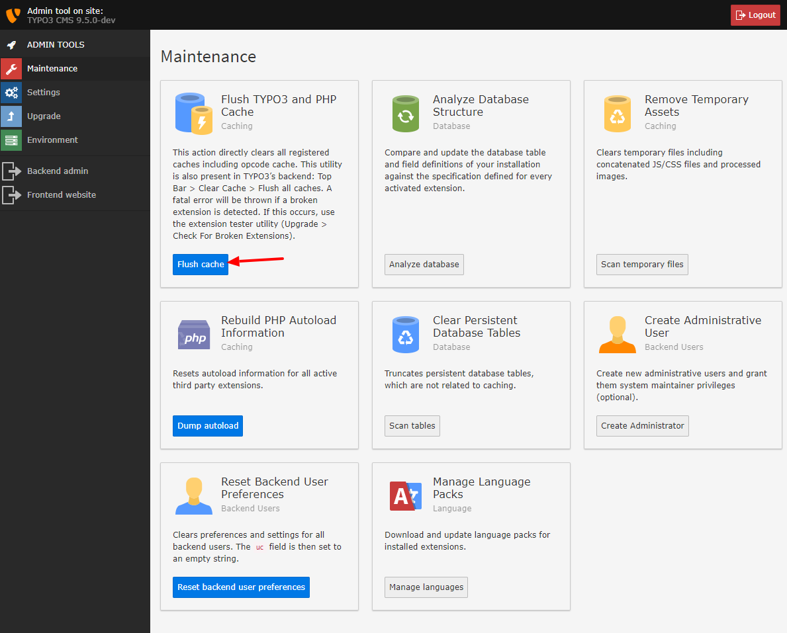

.. include:: ../../Includes.txt

.. _remove-temporary-cache-files:

Clear Caches
^^^^^^^^^^^^

You should also clear all caches when upgrading.

Go to "Maintenance" and click "Flush":

   The option "Flush" in the Install Tool.

Additionally, after an upgrade to a new major version, you should also
delete the other temporary files, which TYPO3 saves in :file:`typo3temp/`. In
the Install Tool go to "Clean up" to do so.

.. figure:: ../../Images/Remove-Temporary-Assets.png
   :class: with-shadow
   :alt: Remove temporary assets.

   The option "Remove temporary assets" in the Install Tool.