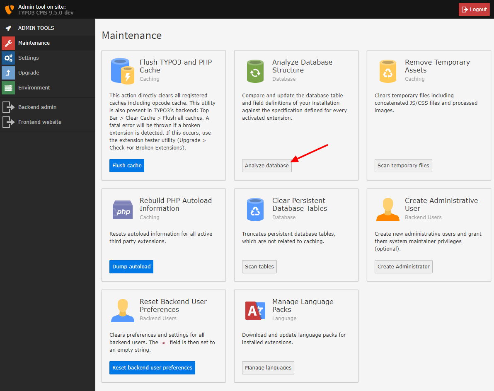

.. include:: ../../Includes.txt

.. _run-the-database-analyzer:

Run the Database Analyzer
^^^^^^^^^^^^^^^^^^^^^^^^^

While in the previous step, tables and columns have been *changed or added* 
to allow running the upgrade wizards smoothly. The next step gives you the 
possibility to *remove* old and unneeded tables and columns from the database.

Use the "Maintenance section" and click "Analyze Database".

You will be able to execute queries to remove these tables and columns
so that your database corresponds to the structure required for the new
TYPO3 version.

.. warning::

   Be careful if you have deliberately added columns and/or tables to your
   TYPO3 database for your own purposes! Those tables and columns are
   removed only if you mark them to be deleted of course, but please be
   careful that you don't delete them by mistake!

.. note::
   
   TYPO3 does not directly remove tables and fields, but first renames them with a prefix
   `zzz_deleted_*`. This allows checking whether the fields and tables really are not needed
   anymore or were accidentally marked as deleted by wrong configuration. 

   When you are sure you aren't going to need them anymore, you can drop them via the wizard.

Select the upgrades you want and press "Execute":

.. figure:: ../../Images/Important-Actions-Database-Analyzer-Updates-Executed.png
   :class: with-shadow
   :alt: Database analyzer

   The Database Analyzer 

When you then click "Compare current database with specification" again
and you only see the message

.. figure:: ../../Images/Important-Actions-Database-Analyzer-Database-Analyzed.png
   :class: with-shadow
   :alt: Database analyzer

   The Database Analyzer with no updates to do.

then all database updates have been applied.
