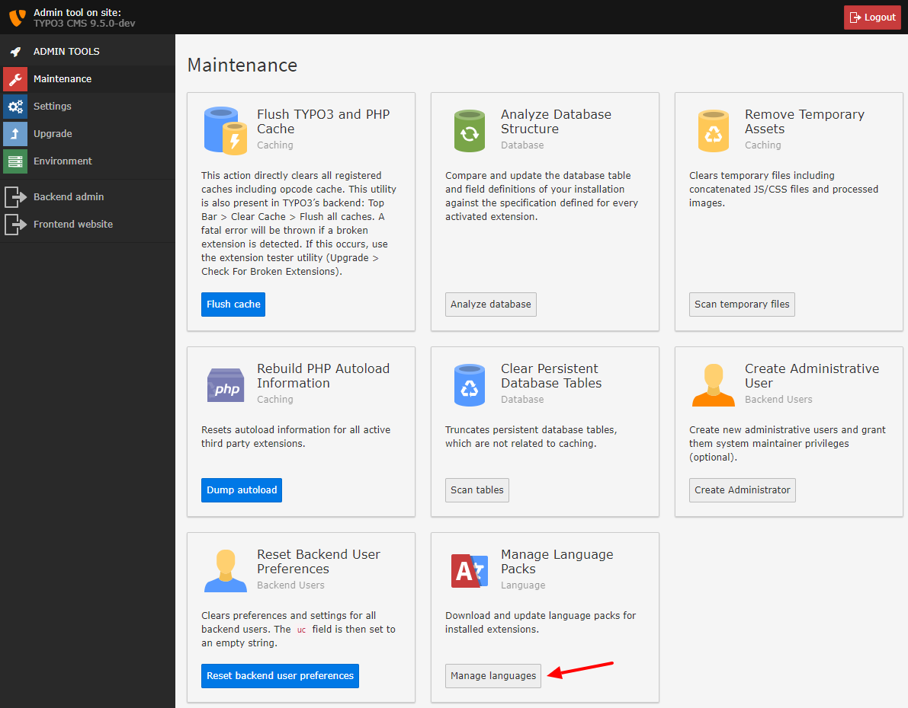

.. include:: ../../Includes.txt

.. _update-translations:

===================
Update Translations
===================

In the Install tool, go to the module "Maintenance" -> "Manage languages" and
update your translations. If you don't update your translations, new texts will
only be displayed in English. The translations are available, once the
`Translation Team`_ for your language has translated the texts.

   The option "Manage language packs" in the Install Tool.

.. _Translation Team: https://wiki.typo3.org/Translations#Translation_Teams

