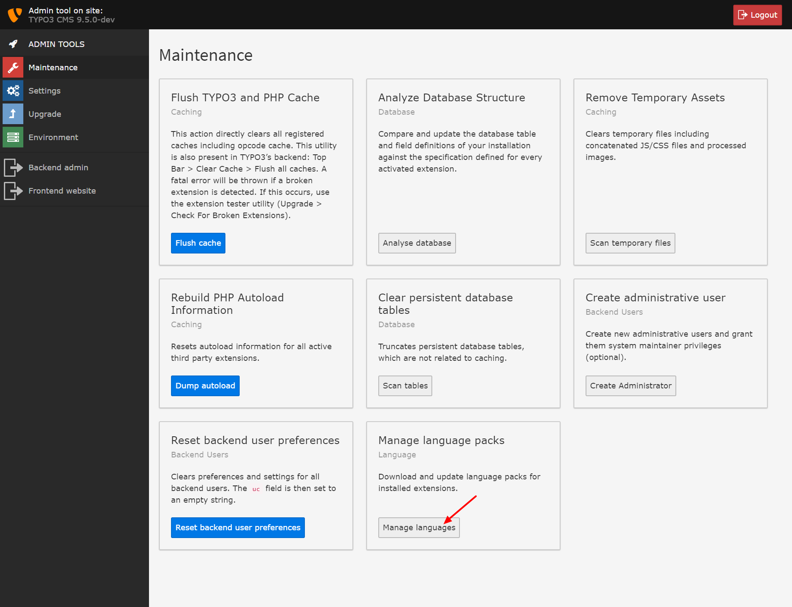

.. include:: /Includes.rst.txt

.. _update-translations:

===================
Update Translations
===================

In the Install tool, go to the module "Maintenance" -> "Manage languages" and
update your translations. If you don't update your translations, new texts will
only be displayed in English. Missing languages or translations can be added
following the section
:ref:`Internationalization and Localization <t3coreapi:internationalization>`.

   The option "Manage language packs" in the Install Tool.
