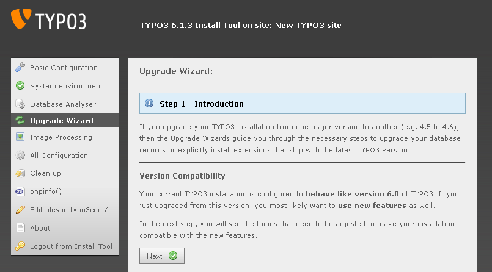
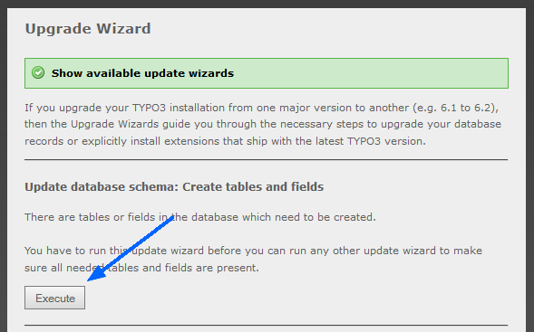

.. include:: /Includes.rst.txt

.. _use-the-upgrade-wizard:

Use the upgrade wizard
^^^^^^^^^^^^^^^^^^^^^^

Enter the Install Tool at :samp:`https://example.org/typo3/install/` on your TYPO3 site.

(If you don't know the current Install Tool password, you can set a new
one by entering one in the Install Tool login screen, hitting enter and
then setting the displayed hash as value of
['BE']['installToolPassword'] in
:file:`typo3conf/LocalConfiguration.php`.)

TYPO3 provides an upgrade wizard for easy upgrading. Go to the
"Upgrade Wizard" section and take a look at the different wizards
provided. You should go them through one by one.

You must start by using the "Update database schema: Create tables and
fields" wizard, which adds new tables and columns to the database.

Click "Execute". Now all :file:`ext_tables.sql` files from core and extensions
are read and compared to your current database tables and columns. Any
missing tables and columns will be shown and you'll be able to execute
queries sufficient to add them.

After you added these tables and columns, go on to the next wizard.

The "Version Compatibility" wizard sets the compatibility version of
your TYPO3 installation to the new version. This allows your Frontend
output to use new features of the new TYPO3 version.

.. note::
   This wizard might affect how your website is rendered. After finishing
   the upgrade, check that your website still displays the way it is
   supposed to be and adjust your TypoScript if necessary.

Go through all wizards and apply the (database) updates they propose.
Please note that some wizards provide optional features, like
installing system extensions (for example simulatestatic) that you may
not need in your current installation, so take care to only apply those
wizards, which you really need.

The last upgrade wizard "Update database schema: Modify tables and
fields" finally changes definitions of existing tables and columns as
needed. You will be able to execute queries to adapt them so that
the tables and columns used by the TYPO3 Core correspond to the
structure required for the new TYPO3 version.

